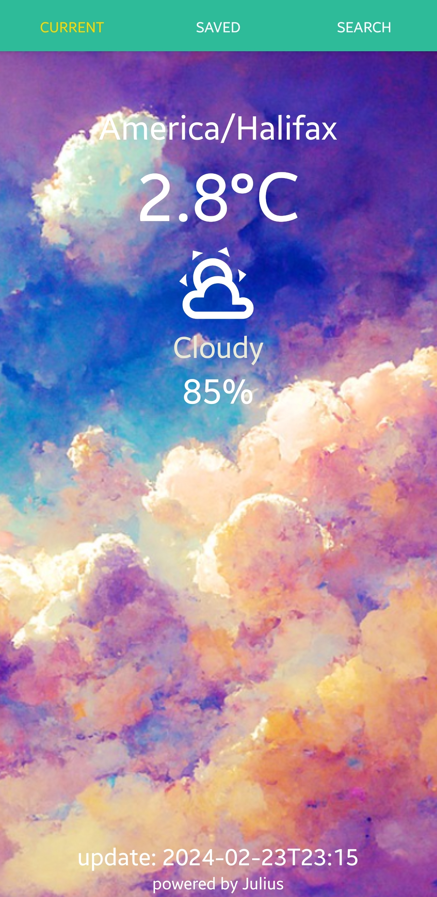
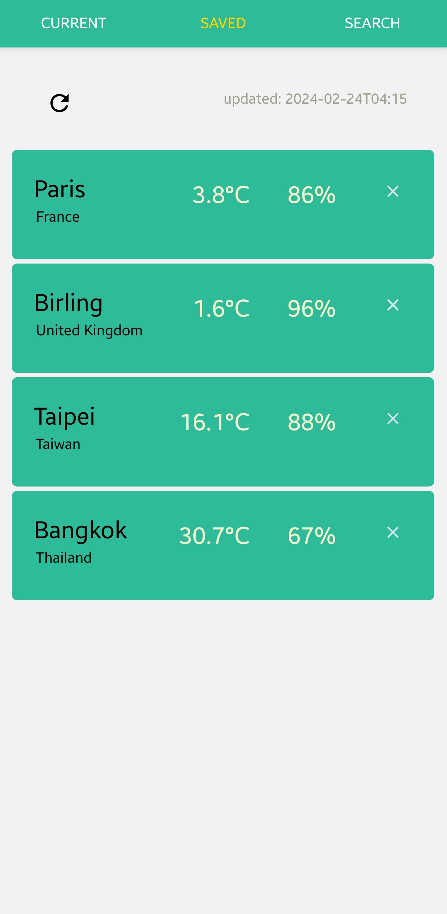
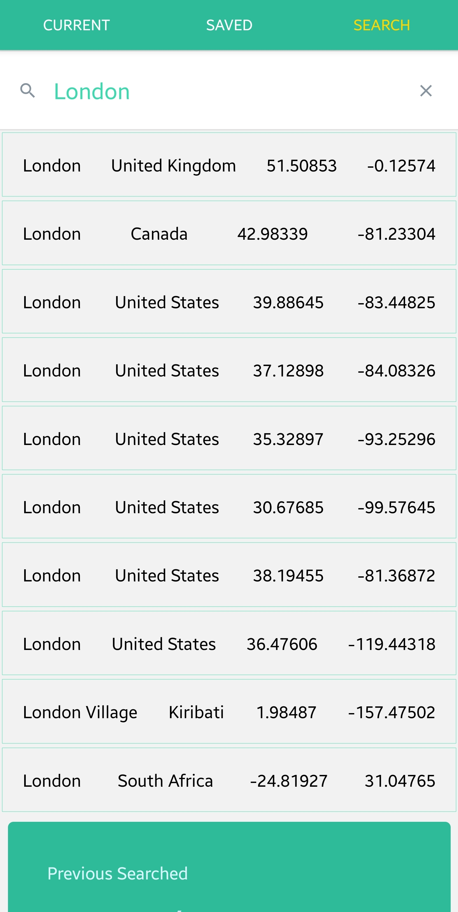
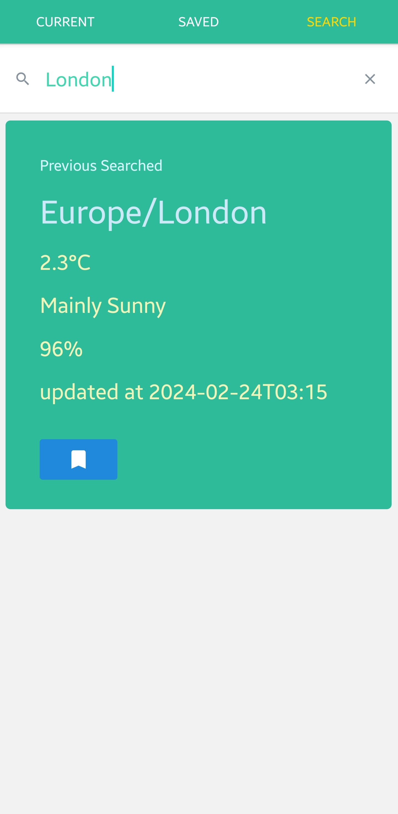

## MCDA Weather Mobile App

### Basic Funcions:
- Show weather of the current location
- Search weather for a particular timezone or city
- Save up to 4 cities and track weather information

### Hosting:
- `npm i`
- `npm i expo-cli`
- `npx expo start --tunnel` or `npx expo start`

### Usage:
- swipe left or right to change between screens

#### Current Weather Page

- note: background can dynamically change based on weather

#### Saved City Page

- note: press refresh button to get latest weather for all cities

#### Search Page

- note: auto suggestion while typing
- choose city to preview latest weather
- press save button to save
